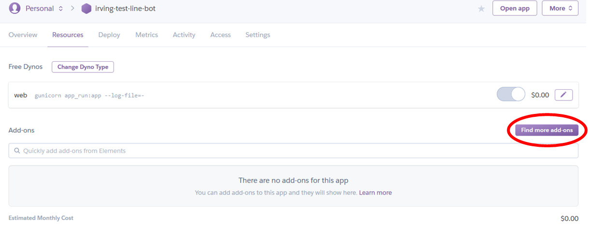
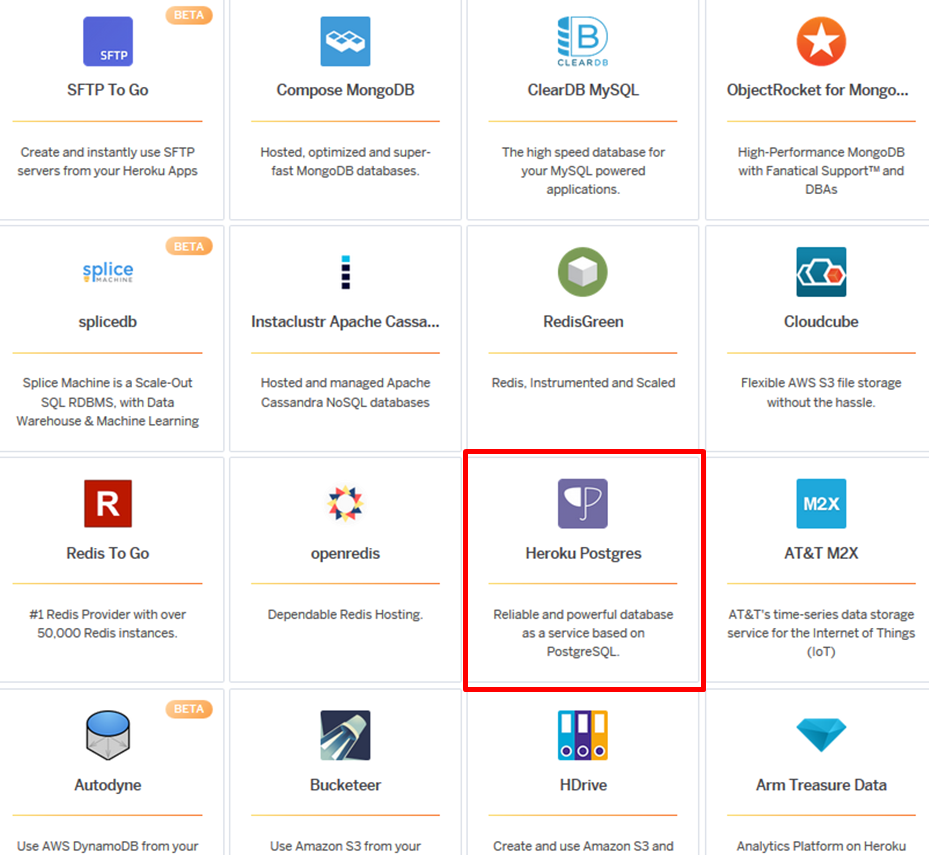
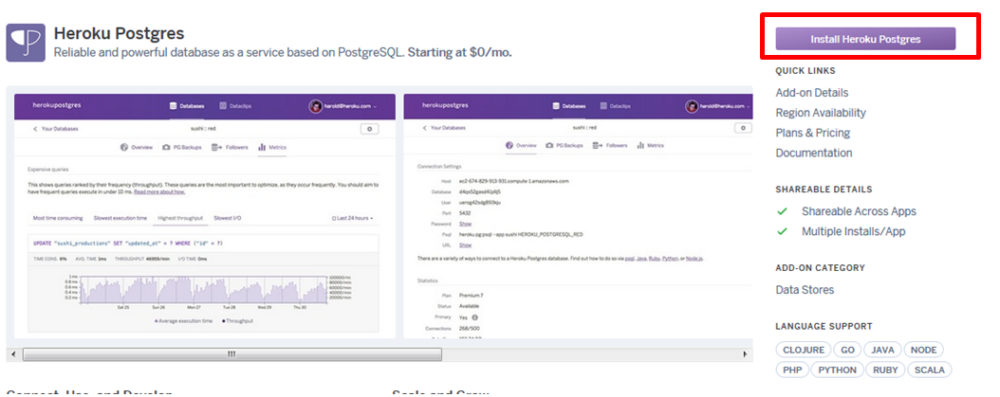
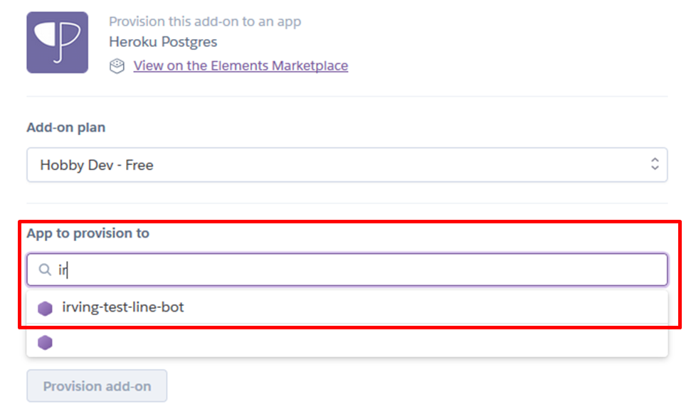
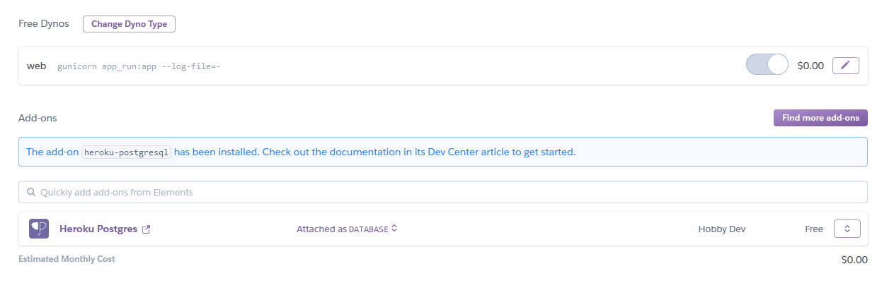
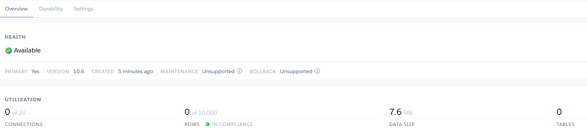

# LineBot_with_Database
使用python flask_sqlalchemy在Heroku上連結heroku-postgresql資料庫

沒有建立過Line BOT的其實也可以看這一篇，我會單純的做出一個可以直接看的網頁，之後在搭配上Line BOT，若是想要先做Line BOT的話可以看到我另外一篇[教學](https://github.com/jj2564/LineBot_Basic)。


##  Heroku Postgresql
先來建立免費的資料庫，回到我們[Heroku的頁面](https://dashboard.heroku.com/apps) 
```
https://dashboard.heroku.com/apps/[YOUR APP NAME]/resources  
```
  
  
選取 Find more add-ons後可以看到有許多的免費資料庫  
  
  
  
進去後不用看太多就直接按install吧  
  
在圈起來的地方選擇要對應的APP，確定後我們回到Heroku的APP畫面可以看到已經多一個資料庫了  
  
我們就來選這個連接好的資料庫裡面會有顯示目前的資料庫的情況  
  
看到這邊我們就完成了第一階段的動作了，接下來我們準備進入下一個步驟。

## Manager and SQLAlchemy

