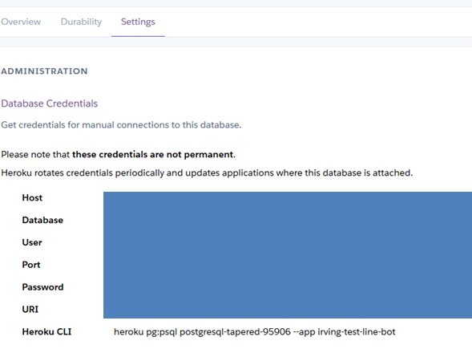
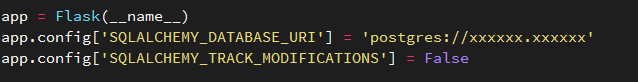
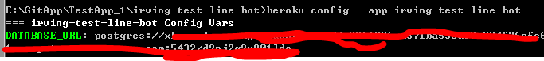
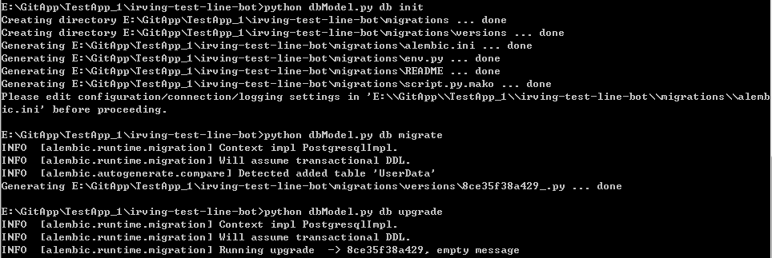
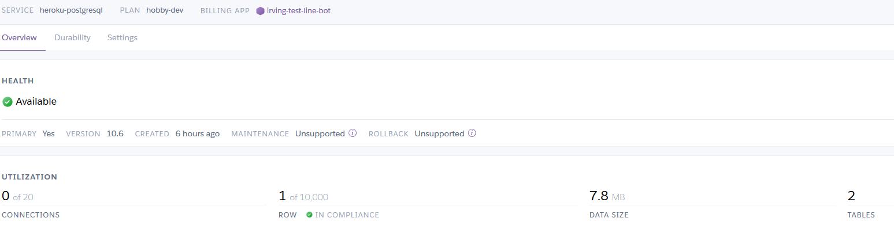
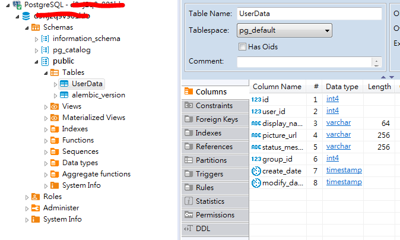
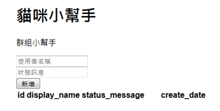
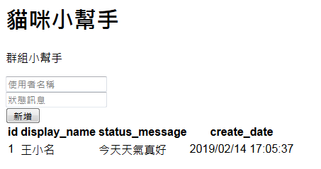
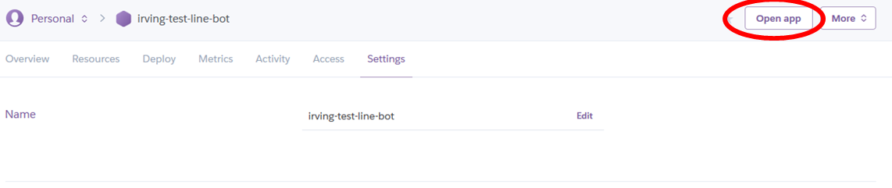

# Heroku_with_Database
使用python flask_sqlalchemy在Heroku上連結heroku-postgresql資料庫

這篇我會單純的做出一個可以直接看的網頁，之後在搭配上Line BOT，若是想要先做Line BOT或是不會部署Heroku的話可以看到我另外一篇[教學](https://github.com/jj2564/LineBot_Basic)。


## Step1 Heroku Postgresql
先來建立免費的資料庫，回到我們[Heroku的頁面](https://dashboard.heroku.com/apps) 
```
https://dashboard.heroku.com/apps/[YOUR APP NAME]/resources  
```
  
  
選取 Find more add-ons後可以看到有許多的免費資料庫  
  
  
  
進去後不用看太多就直接按install吧  
  
在圈起來的地方選擇要對應的APP，確定後我們回到Heroku的APP畫面可以看到已經多一個資料庫了  
  
我們就來選這個連接好的資料庫裡面會有顯示目前的資料庫的情況  
  
    
選取Setting來到這個畫面，看到這邊我們就完成了第一階段的動作了，接下來我們準備進入下一個步驟。

## Step2 Manager and SQLAlchemy
請先把我的範例專案clone下來到你本機的位置
```
git clone https://github.com/jj2564/LineBot_with_Database.git
```
裡面應該會有  
/app_run.py  
/dbModel.py  
/Procfile  
/requirement.txt  
/template/index.html   
這些檔案

我們打開 dbModel.py  
  
我們看到app.config中有一個設定"SQLALCHEMY_DATABASE_URI" 我們回到Heroku Postgresql的Setting中把URI後面那一長串的東西複製貼上來吧  
也可以透過在CMD輸入
```
$heroku config --app [YOUR APP NAME] 
```
  
這一組URI請妥善的隱藏好，他人取得這組即可操作你的DB了。  

看到裡面我已經預先設定好資料庫該有的內容，我根據官方的文件把UserData大概會需要的欄位先開好了。  
其他的程式碼我們就先不管了。  

如果要載在本地先嘗試的編譯執行的話請先安裝 psycopg2
```
$pip install psycopg2
```
可以確認一下我放在requirement.txt裡面有哪些LIB，沒有的話都記得裝一下，這樣才能在本地端編譯成功。 
在編譯前我們記得先把這個專案的git指到我們的Heroku上  
```
heroku git:remote -a [YOUR APP NAME] 
```

接下來陸續鍵入
```
$python dbModel.py db init
$python dbModel.py db migrade
$python dbmodel.py db upgrafe
```
就會看到以下的結果  
  

這時候回到網站上看可以發現我們的統計改變了，本來沒有row變成1個row，也多出了一張table  
  

這邊推薦一個Database的工具 [DBeaver](https://dbeaver.io/) 安裝好之後我們把在Setting內看到的帳號密碼等等的東西都打進去
  
我們可以看到我們的資料庫已經在上面建立好Table囉。

我們這時候可以先透過本地端來確認是否有效用了
```
$python app_run
```
然後在瀏覽器下面我們能夠看到網頁已經出現了，在這邊並沒有展示所有的欄位，因為這部分為止都只是DEMO的部分，user_id, group_id最好不要讓他人知道  
   
可以先在這邊嘗試一下輸入資料後按新增，可以看到我們成功新增資料了  
  
接者我們透過Ctrl+C關掉我們的網戰，把我們的檔案都打上Heroku吧
```
git add .
git commit -m "Test the database"
git push heroku master
```
完成後可以看到一下自己的網站，也可以參考[我的網站](https://irving-test-line-bot.herokuapp.com/)    
  
因為我們套用的是線上資料，打開來後會發現跟我們本地的網站顯示得一模一樣，資料也都會存在。  
到這邊為止又到了一個段落。
